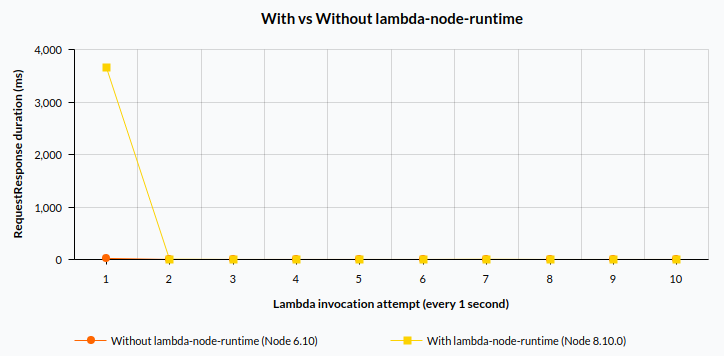
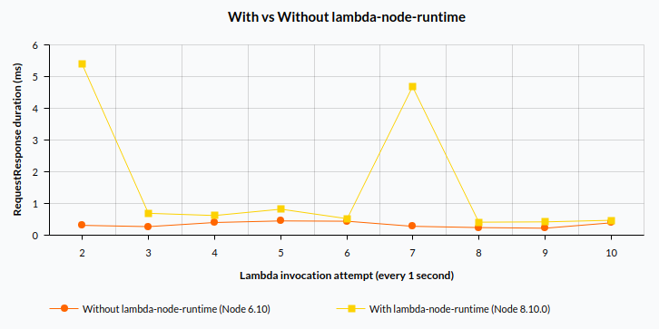

# Lambda Node Runtime

The module allows you to run your JavaScript code on any Node.js version in AWS Lambda.

AWS Lambda rarely updates Node.js version, in fact AWS Lambda Node.js version problem looks  similar to one Babel tries to solve for JS versions. This module enables you to use latest Node.js version with latest features and bug/security fixes.

## Quick start

### Installation
Add module to your AWS Lambda Node.js project:
```
npm install lambda-node-runtime -S
```

### Usage
Write a module that holds AWS Lambda handler:
```js
module.exports.handler = async (event, context) => {
    // Your code
}
```
or
```js
module.exports.handler = (event, context, callback) => {
    // Your code
}
```
Reference your handler using AWS Lambda Environment Variable
```
LAMBDA_NODE_HANDLER=index.handler
```
Choose `Node.js 6.10` AWS Lambda Runtime, increase Timeout to at least 4 seconds (see [Benchmarks](#benchmarks) section for more details) and set AWS Lambda Handler to expression
```
node_modules/lambda-node-runtime/index.handler
```
Optionally set desired Node.js version in `package.json` (default is latest LTS version 8.x (Carbon))
```json
{
    "name": "your-lambda-function",
    "version": "1.0.0",
    "lambda-node-runtime": {
        "node-version": "9.8.0"
    }
}
```

## How it works
When you install `lambda-node-runtime` module it downloads Node to `node_modules/lambda-node-runtime/.node` dir. Therefore, when you create an AWS Lambda Function package it includes desired Node runtime. When AWS Lambda Function package is deployed and invoked, bundled Node child process starts and executes your JS code.

### Why is this possible?
It is possible to run Node version of your desire because Node binary is relatively small (around 10 MB when zipped) so there is plenty of space left for code (AWS Lambda Function package size restriction is 50 MB).

Also Node is fast to start so the latency between when you invoke AWS Lambda Function and when it actually starts running the code is lower.

Please note that latency is there because new Node.js child process must be started. However, Node.js child process is reused in warm AWS Lambda Function meaning only cold start is slower.

### Benchmarks
This aim of this section is help you to understand `lambda-node-runtime` module suitability for your use case.

The chart depicts execution of test AWS Lambda Function (that returns the event object passed to it)
```js
module.exports.handler = (event, context, callback) => {
    callback(null, event);
}
```
Both AWS Lambda Functions are allocated 128 MB of Memory.



It takes around 4 seconds for cold AWS Lambda Function to start in case of `lambda-node-runtime` is used (compared to 20 milliseconds in case of plain AWS Lambda Runtime). According to [this article](https://read.acloud.guru/how-long-does-aws-lambda-keep-your-idle-functions-around-before-a-cold-start-bf715d3b810) AWS keeps the idle Lambda Function warm for up to 1 hour. It is also important to understant that cold start happends once for each AWS Lambda Function concurrent exection. [Here is a good article that provides more details](https://hackernoon.com/im-afraid-you-re-thinking-about-aws-lambda-cold-starts-all-wrong-7d907f278a4f). 

The reason why the first run with `lambda-node-runtime` takes significantly longer is significant amount of CPU required to start a new process (i.e.: allocate memory, resource descriptors). [AWS Lambda allocates CPU power proportional to the memory](https://docs.aws.amazon.com/lambda/latest/dg/resource-model.html). It takes around 200 ms (20 times less than when 128 MB of Memory is allocated) for first run to complete in case 3 GB/RAM of Memory is allocated for AWS Lambda Function.

Let's hide the first run to compare subsequent runs.



Subsequent runs duration (except 2nd and 7th runs) is very similar. Please note that despite 2nd and 7th runs take relatively longer, it is only around 5 milliseconds.

The reasons why all the runs with `lambda-node-runtime` take a bit longer are:
- the effort to resume the frozen Node.js child process in warm AWS Lambda Function before each run
- the effort to serialize event and result objects between parent and child processes using IPC
